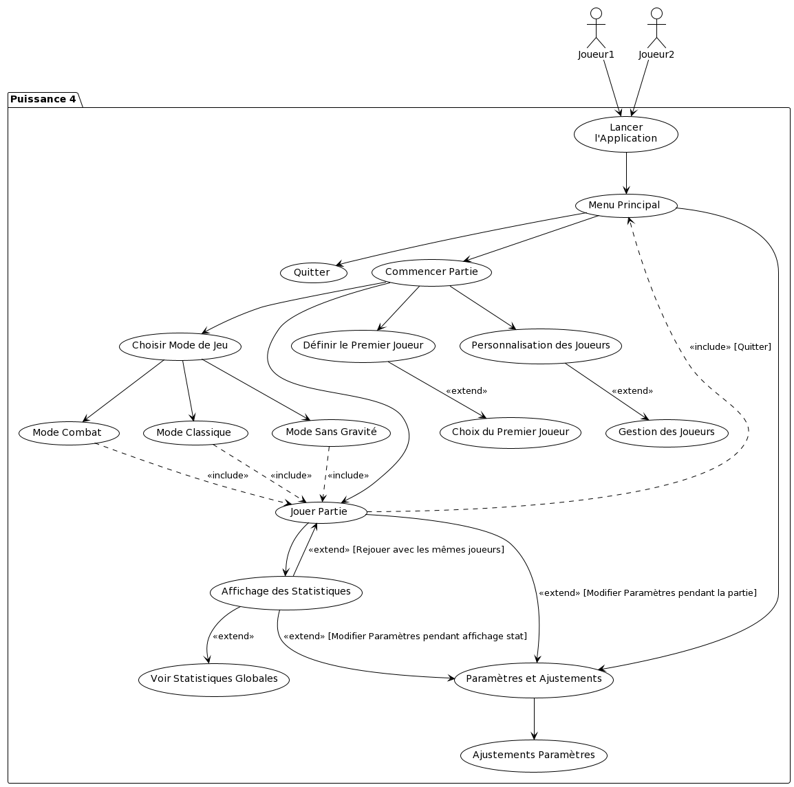

# Diagramme de cas d'utilisateur (use case)

    

## *__Cas 1 - Lancer l'Application__*

|1)                              | Lancer l'Application                                      |
| ------------------------------ | --------------------------------------------------------- |
| **Nom**                        | Lancer l'Application                                      |
| **Objectif**                   | Permettre aux joueurs d'accéder au jeu Puissance 4        |
| **Acteurs principaux**         | Joueur1, Joueur2                                           |
| **Condition initiale**         | Les joueurs ont l'application installée sur leur dispositif|
| **Scénario d'utilisation**     | 1. Joueur1 ou Joueur2 cliquent sur l'icône de l'application.   2. L'application se lance et affiche l'écran d'accueil. |
| **Condition de fin**           | L'écran d'accueil de l'application est affiché.            |

## *__Cas 2 - Personnalisation des Joueurs__*

|2)                              | Personnalisation des Joueurs                              |
| ------------------------------ | --------------------------------------------------------- |
| **Nom**                        | Personnalisation des Joueurs                              |
| **Objectif**                   | Permettre aux joueurs de personnaliser leur profil avant de commencer à jouer |
| **Acteurs principaux**         | Joueur1, Joueur2                                           |
| **Condition initiale**         | Les joueurs ont accédé à l'écran de personnalisation       |
| **Scénario d'utilisation**     | 1. Les joueurs choisissent de créer un nouveau joueur, choisir un joueur existant ou supprimer un joueur.   2. Les joueurs personnalisent leur nom et leurs pions.  3. Les choix sont sauvegardés. |
| **Condition de fin**           | Les profils des joueurs sont personnalisés et sauvegardés. |

## *__Cas 3 - Jouer Partie__*

|3)                              | Jouer Partie                                              |
| ------------------------------ | --------------------------------------------------------- |
| **Nom**                        | Jouer Partie                                              |
| **Objectif**                   | Engager les joueurs dans une partie de Puissance 4 selon les modes et paramètres sélectionnés |
| **Acteurs principaux**         | Joueur1, Joueur2                                           |
| **Condition initiale**         | Les modes de jeu et les paramètres de la partie sont définis |
| **Scénario d'utilisation**     | 1. Les joueurs commencent la partie selon le mode de jeu sélectionné.       2. Les joueurs jouent à tour de rôle.  3 La partie se poursuit jusqu'à un alignement de quatre pions ou jusqu'à ce que le tableau soit plein. |
| **Condition de fin**           | La partie est terminée avec un gagnant ou un match nul.    |

## *__Cas 4 - Affichage des Statistiques__*

|       4)                         | Affichage des Statistiques                                |
| ------------------------------ | --------------------------------------------------------- |
| **Nom**                        | Affichage des Statistiques                                |
| **Objectif**                   | Montrer les résultats et les statistiques de la partie aux joueurs |
| **Acteurs principaux**         | Joueur1, Joueur2                                           |
| **Condition initiale**         | La partie est terminée                                    |
| **Scénario d'utilisation**     | 1. Les statistiques de la partie jouée sont affichées, incluant le gagnant et le nombre de parties gagnées/perdues.  2. Les joueurs ont l'option de rejouer avec les mêmes paramètres, de modifier les paramètres ou de quitter. |
| **Condition de fin**           | Les joueurs choisissent de rejouer, de modifier les paramètres, ou de quitter l'application. |

